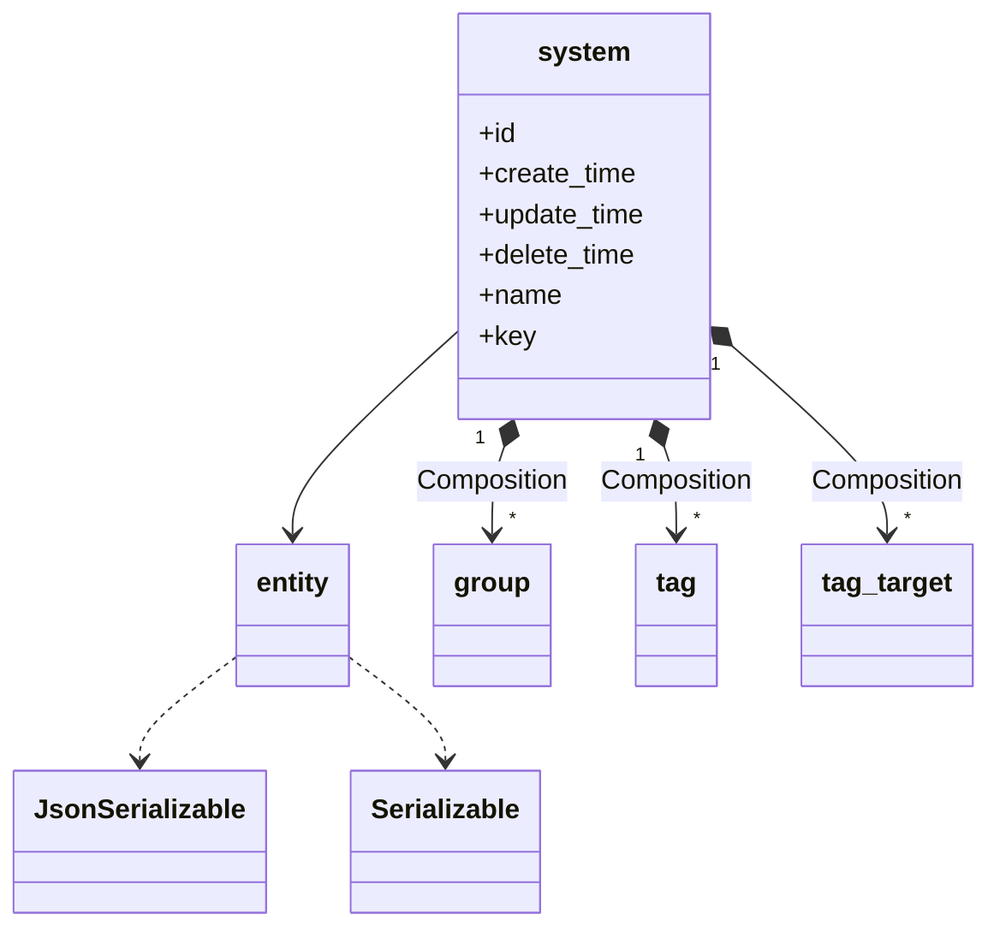
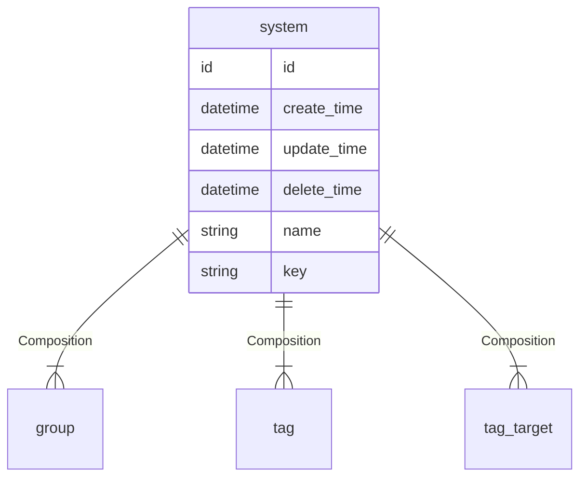

# 系统  
系统

### 关联关系  

与系统相关的类图:  

相关的 `E-R` 图:  

### 实体属性

这里是指系统在编码过程中可以被直接调用的属性，其中 `必要` 是指在系统创建时，是否必须要有的属性，可选属性可在创建系统后再赋值。  
**属性表:**   

|属性键名|数据类型|必要|名称|描述|
|----|----|----|----|----|
|id|id|无需|主键|主键会自动生成，无需赋值|
|create_time|datetime|无需|创建时间|会自动生成，无需赋值|
|update_time|datetime|无需|更新时间|会自动更新，无需赋值，创建时与 `create_time` 一致|
|delete_time|datetime|无需|删除时间|会自动维护，无需赋值|
|groups|[group](entity/group.md)|可选|关联关系|系统拥有的分组，是包含 `group` 的数组|
|tags|[tag](entity/tag.md)|可选|关联关系|系统拥有的标签，是包含 `tag` 的数组|
|tag_targets|[tag_target](entity/tag_target.md)|可选|关联关系|系统拥有的标签与目标的关联，是包含 `tag_target` 的数组|
|name|string|必传|名称|名称|
|key|string|必传|密钥|密钥|

### 常量

