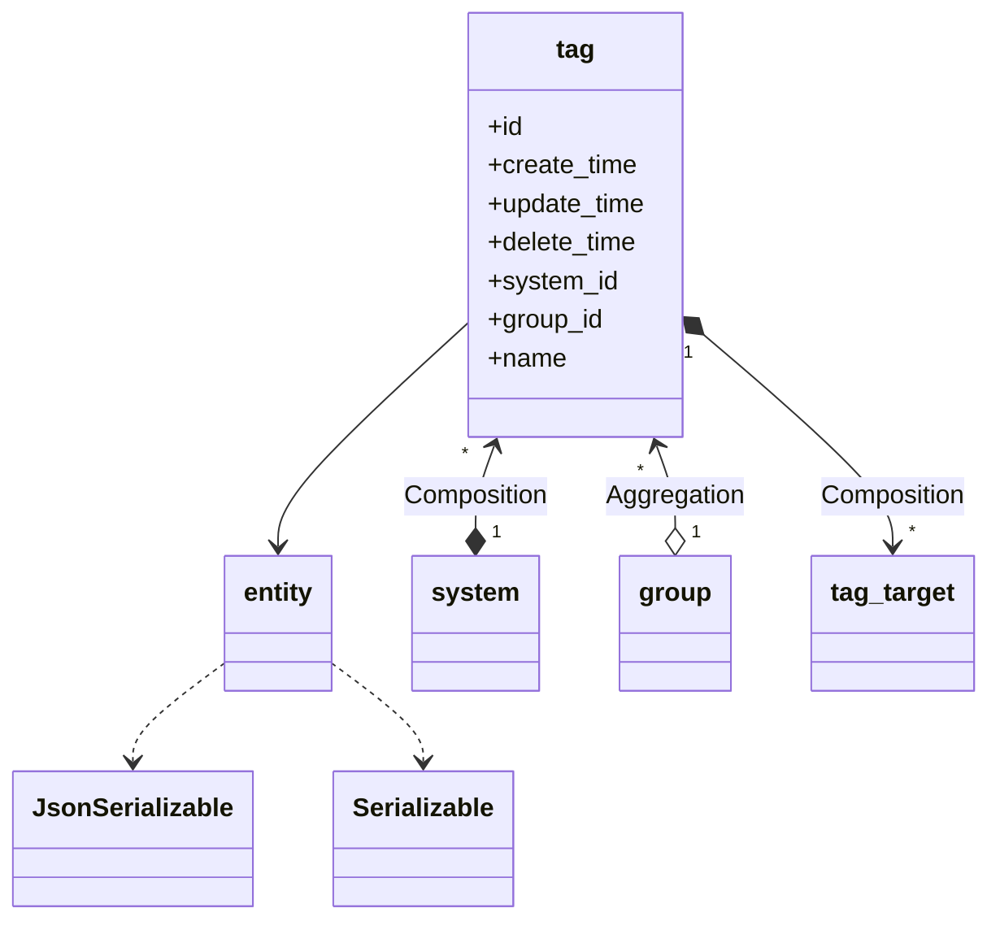
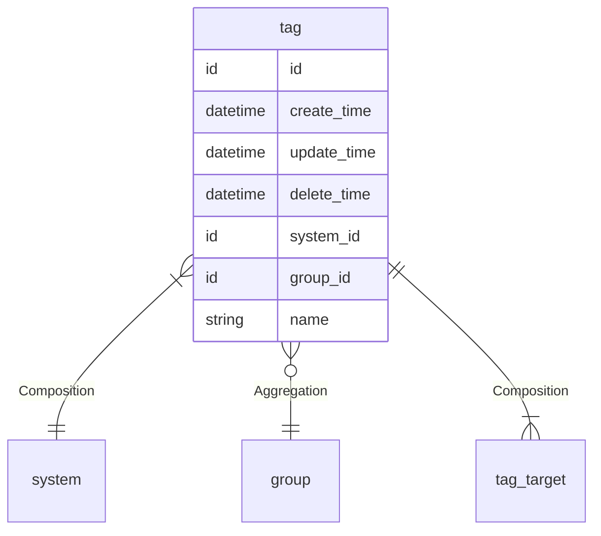

# 标签  
标签

### 关联关系  

与标签相关的类图:  

相关的 `E-R` 图:  

### 实体属性

这里是指标签在编码过程中可以被直接调用的属性，其中 `必要` 是指在标签创建时，是否必须要有的属性，可选属性可在创建标签后再赋值。  
**属性表:**   

|属性键名|数据类型|必要|名称|描述|
|----|----|----|----|----|
|id|id|无需|主键|主键会自动生成，无需赋值|
|create_time|datetime|无需|创建时间|会自动生成，无需赋值|
|update_time|datetime|无需|更新时间|会自动更新，无需赋值，创建时与 `create_time` 一致|
|delete_time|datetime|无需|删除时间|会自动维护，无需赋值|
|system|[system](entity/system.md)|必传|关联关系|标签所属的系统|
|system_id|id|无需|外键|标签所属的系统，此处为系统的`id`|
|group|[group](entity/group.md)|可选|关联关系|标签所属的分组|
|group_id|id|无需|外键|标签所属的分组，此处为分组的`id`|
|tag_targets|[tag_target](entity/tag_target.md)|可选|关联关系|标签拥有的标签与目标的关联，是包含 `tag_target` 的数组|
|name|string|必传|名称|名称|

### 常量

